In previous project, we explored `AWS S3 backend` as the remote backend to store Terraform state files and refactored our terraform codes into modules and as a result the introduction of modules into our codebase it saved us time and reduce costly errors by re-using configuration written either by yourself, other members of your team, or other Terraform practitioners who have published modules for you to use.

For this project we are going to explore another option, which is the `terraform cloud`.
We will also use `Packer` to build our machine images, and `Ansible` to configure the infrastructure.

Before you proceed ensure you have the following tools installed on your local machine;

- Packer. Follow this link to install [Packer](https://developer.hashicorp.com/packer/tutorials/docker-get-started/get-started-install-cli)

- Ansible. Follow this link to install [Ansible](https://docs.ansible.com/ansible/latest/installation_guide/intro_installation.html)

- AWS CLI. Follow sthis link to configure [AWS CLI](https://docs.aws.amazon.com/cli/latest/userguide/getting-started-install.html)

**What is Packer?**

Packer is HashiCorp's open-source tool for creating machine images for multiple platforms from a single source configuration. Packer automates the creation of any type of machine image. It embraces modern configuration management by encouraging you to use automated scripts to install and configure the software within your Packer-made images.

Here's how Packer works with AMIs:

- **Configuration:** You define a configuration file in JSON or HCL (HashiCorp Configuration Language) that specifies what kind of image you want to build, including the source machine image, provisioners (scripts or software to install), and any custom settings.
- **Builder:** Packer uses a builder to create a virtual machine or instance from a base image. For AWS, this is typically an EC2 instance. Packer launches this instance, applies the configuration, and provisions the machine based on your specifications.
- **Provisioners:** Packer supports various provisioners like shell scripts, Ansible, Chef, or Puppet. These provisioners are used to configure the instance after it's launched. You can install software, configure settings, and make other customizations.
- **Image Creation:** Once the instance is provisioned and configured according to your specifications, Packer shuts it down and creates an image (e.g., an AMI for AWS) from the instance. This image is a snapshot of the configured virtual machine.
- **Cleanup:** After the image is created, Packer can optionally clean up any temporary resources like the EC2 instance, leaving you with just the image.

Packer is a powerful tool for creating consistent and versioned machine images. It's commonly used in DevOps and infrastructure-as-code (IaC) workflows to ensure that the infrastructure is reproducible, tested, and version-controlled.

## STEP 1

Clone down this [AMI repository](https://github.com/MayorFaj/AMI-p19.git) to your local machine and `cd AMI-p19`.

Before running the `packer build` command, make sure to configure the AWS CLI on your local machine. Packer relies on the AWS CLI for authentication and access to AWS resources.
Running the `aws configure` command will prompt you to enter your *AWS Access Key ID* and *AWS Secret Access Key*.. It provides the neccessary permissions to interact with AWS resources.

Go ahead to build the images

Run 

`packer build bastion.pkr.hcl`

`packer build nginx.pkr.hcl`

`packer build ubuntu.pkr.hcl`

`packer build web.pkr.hcl`

The output will look like this;

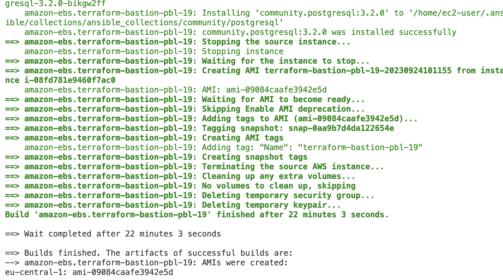 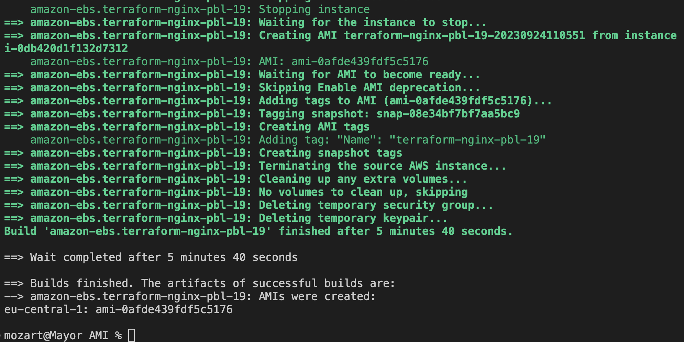

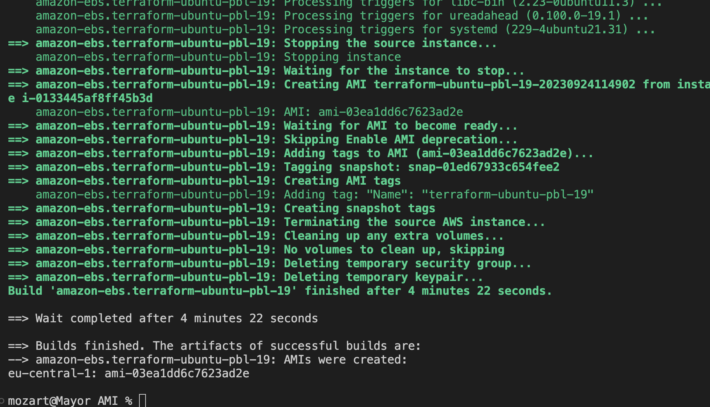 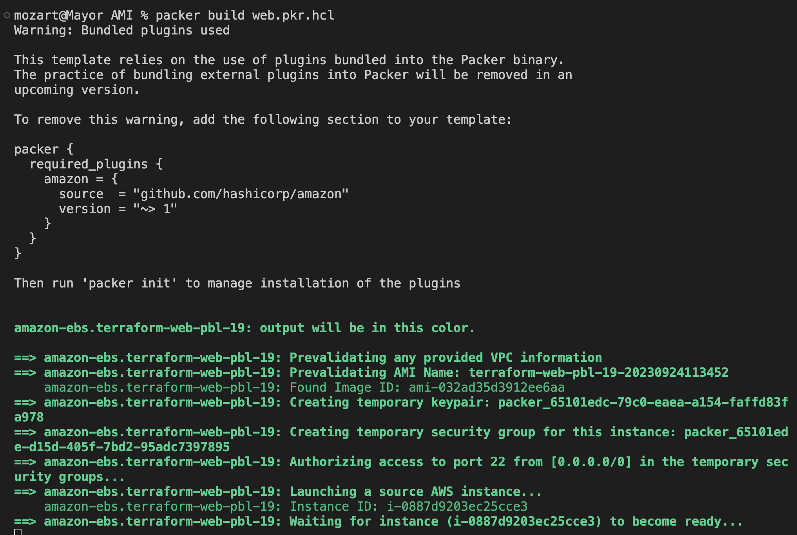

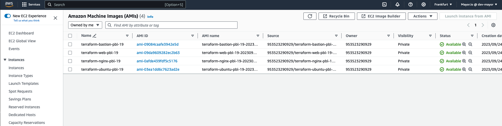

Next step is to configure terraform cloud

**Terraform Cloud**

Terraform cloud is a managed service provided by HashiCorp for using Terraform to provision and manage infrastructure in a collaborative and efficient way. Terraform Cloud provides you with Terraform CLI to provision infrastructure, either on demand or in response to various events.
If you have a team who works with Terraform, you need a consistent remote environment with remote workflow and shared state to run Terraform commands.
In summary, Terraform Cloud simplifies the management of infrastructure as code (IaC) and is especially useful for teams working on infrastructure projects collaboratively. It ensures consistency, security, and efficiency in managing infrastructure using Terraform.

What's next?

Migrate the .tf code to `terraform cloud` to manage the AWS infrastructure from there.

1. Create a Terraform Cloud account

Follow this [link](https://app.terraform.io/signup/account), create a new account, verify your email

2. Create an organization

Select “Start from scratch”, choose a name for your organization and create it.

3. Configure a workspace

We will use version control workflow as the most common and recommended way to run Terraform commands triggered from our git repository.

Make sure to clone down or fork this terraform [repository](https://github.com/MayorFaj/terraformP19-cloud.git) to your work station and edit accordingly to meet your new changes.

Create a new repository in your GitHub account and call it terraform-cloud, push the Terraform codes to the repository.
**NOTE;**Remember to copy the AMI id created with packer for the bastion, nginx, ubuntu, and webservers to the terraform.auto.tfvars and edit accordingly.

Go back to your terraform account, Choose version control workflow and you will be prompted to connect your GitHub account to your workspace – follow the prompt and add your newly created repository (terraform-cloud) to the workspace.

Move on to “Configure settings”, provide a description for your workspace and leave all the rest settings to default, click “Create workspace”

4. Terraform Cloud supports two types of variables: environment variables and Terraform variables. Either type can be marked as sensitive, which prevents them from being displayed in the Terraform Cloud web UI and makes them write-only.

Set two environment variables: `AWS_ACCESS_KEY_ID and AWS_SECRET_ACCESS_KEY`, set the values used in Project 16. These credentials will be used to provision your AWS infrastructure by Terraform Cloud.

After you have set these 2 environment variables – your Terraform Cloud is all set to apply the codes from GitHub and create all necessary AWS resources.

5. Run `terraform plan` and `terraform apply` from web console.

Before we push our codes to github, comment out the listeners and attachment group for now, reason being that we do not want our Load balancer to forward traffic to the listeners yet, because we still have some configurations we need to put in place, else we will keep getting unhealthy instances.

  
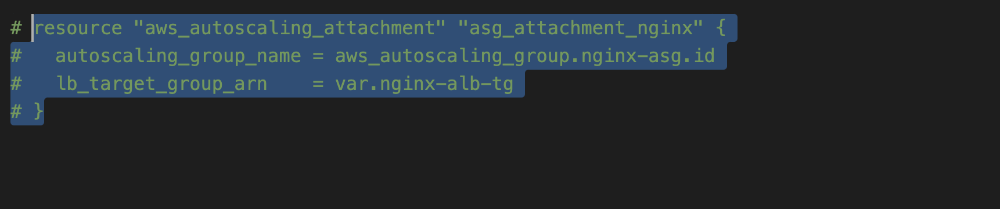 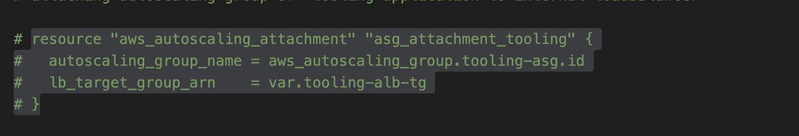 
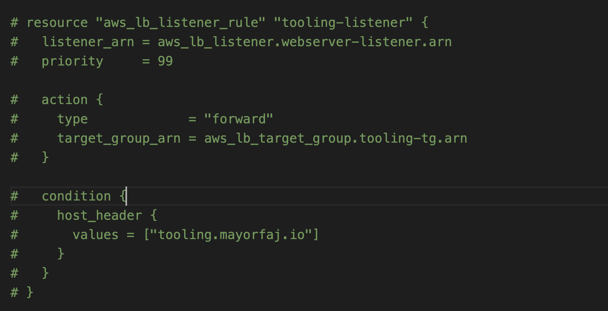 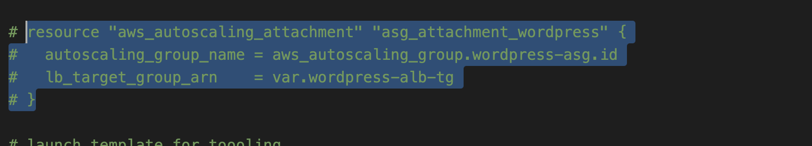

Now Push your changes to github since we have an integration with GitHub, the process will be triggered automatically. Plan must be launched automatically, but to apply you still need to approve manually.
**NOTE**; Even though you can configure “Auto apply”, it is always a good idea to verify your plan results before pushing it to apply to avoid any misconfigurations that can cause ‘bill shock’

- Output for plan

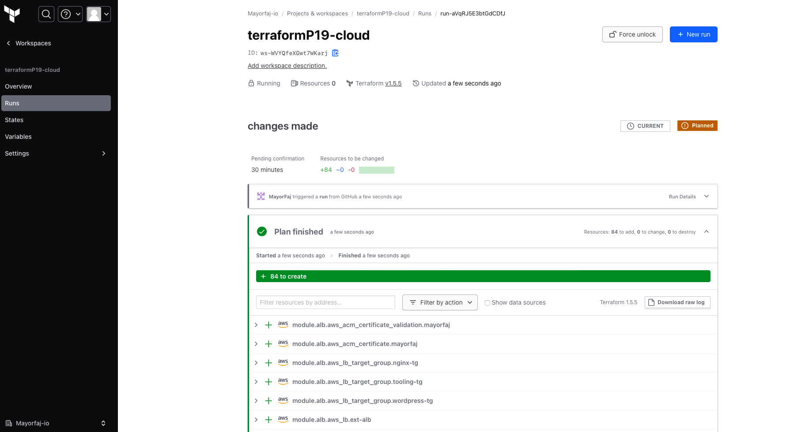

Switch to “Runs” tab and click on “Queue plan manually” button. If planning has been successful, you can proceed and `confirm Apply`, press “Confirm and apply”, provide a comment and “Confirm plan”

Check the logs and verify that everything has run correctly. Note that Terraform Cloud has generated a unique state version that you can open and see the codes applied and the changes made since the last run.

Create an Email and Slack notifications for certain events.
This is the what the email notification looks like

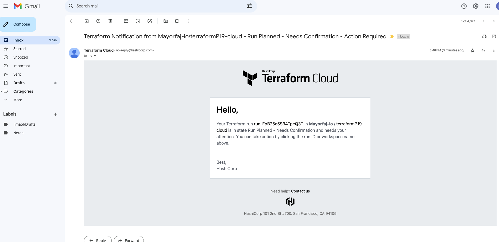

**ANSIBLE**

Before we proceed with the Ansible section of this project, i would like to explain the concept of Dynamic inventory plugin

- Ansible Dynamic Inventory Plugin:
When using Ansible with AWS or other cloud platforms, inventory file maintenance will be a hectic task as AWS frequently changes IPs, autoscaling instances, and more. Once your AWS EC2 hosts are spun up, you’ll probably want to talk to them again. With a cloud setup, it’s best not to maintain a static list of cloud hostnames in text files. Rather, the best way to handle this is to use the aws_ec2 dynamic inventory plugin.

This is how it works here;
The aws_ec2 dynamic inventory plugin makes API calls to AWS to get a list of inventory hosts from Amazon Web Services EC2 in the run time. It gives the EC2 instance details dynamically to manage the AWS infrastructure.

Our infrastucture configuration management will happen from our bastion server, since we have configured our firewall/security-group to allow `ssh` access from the bastion host.

We need to make use of the ssh-agent

- Open up the ssh conf on yor local machine

`sudo vi ~/.ssh/conf`

- Paste below and edit accordingly <Hostname, User, and Path to your private key>

```
Host    *
    StrictHostKeyChecking no

Host    bastion
    ForwardAgent yes
    Hostname 35.156.105.7
    Port 22
    User ec2-user
    IdentityFile ~/Downloads/pal-key.pem

Host    proxy
    ForwardAgent yes
    Hostname 10.0.2.253
    Port 22
    User ec2-user
    IdentityFile ~/Downloads/pal-key.pem
    ProxyCommand ssh bastion -W %h:%p

Host    tooling
    ForwardAgent yes
    Hostname 10.0.8.197
    Port 22
    User ec2-user
    IdentityFile ~/Downloads/pal-key.pem
    ProxyCommand ssh bastion -W %h:%p

Host    wordpress
    ForwardAgent yes
    Hostname 10.0.6.181
    Port 22
    User ec2-user
    IdentityFile ~/Downloads/pal-key.pem
    ProxyCommand ssh bastion -W %h:%p

Host    sonarqube
    ForwardAgent yes
    Hostname 10.0.1.136
    Port 22
    User ubuntu
    IdentityFile ~/Downloads/pal-key.pem
    ProxyCommand ssh bastion -W %h:%p

Host    jfrog
    ForwardAgent yes
    Hostname 10.0.1.190
    Port 22
    User ubuntu
    IdentityFile ~/Downloads/pal-key.pem
    ProxyCommand ssh bastion -W %h:%p

Host    jenkins
    ForwardAgent yes
    Hostname 10.0.1.30
    Port 22
    User ubuntu
    IdentityFile ~/Downloads/pal-key.pem
    ProxyCommand ssh bastion -W %h:%p%   
```

- save and exit

- Run the command below to get on the bastion server, which will serve as a jumpbox to the other servers.

`ssh bastion`

Go ahead , clone this [ansible repo](https://github.com/MayorFaj/Ansible-P19.git) to your bastion server.
**Take note;** 
You need to edit the `EFS access point` and the `RDS endpoint` for the tooling and wordpress. Open the roles/<tooling><wordpress>/tasks/main.yml and setup-db.yml and edit accordingly.

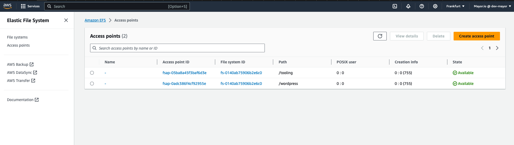 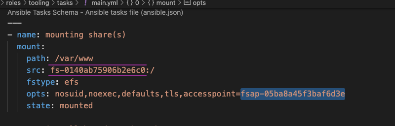

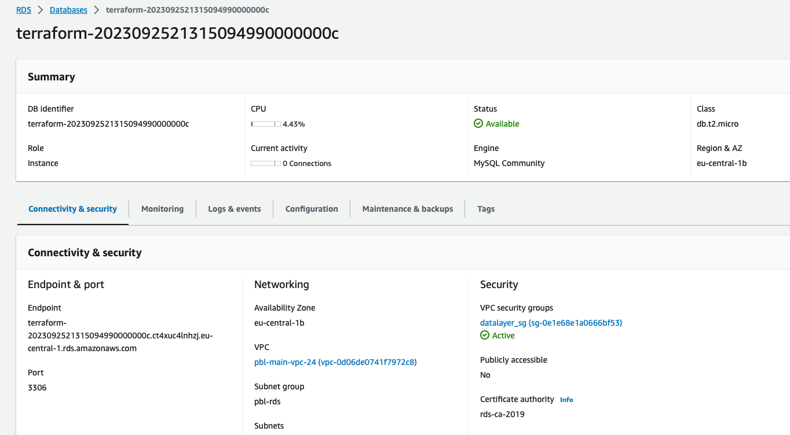 

THere is need to edit the internal load balancer DNS name in the nginx conf as well . This is how our proxy server knows where it is routing traffic to and from. Open the roles/nginx/templates/nginx.conf.j2 , edit accordingly.

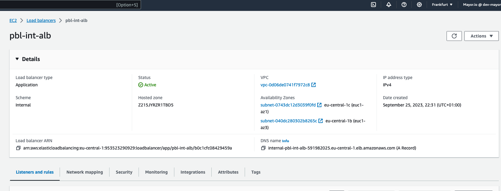 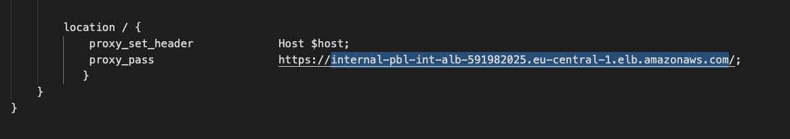

**Attention!!!** Ansible has modules and plugins that allow it to interact with AWS services. These modules rely on Python libraries like `botocore` and `boto3`  to communicate with AWS APIs. Without this, Ansible cannot establish connections to AWS services, making AWS integration impossible. To confirm this, let's change directory into the ansible repo `Ansible-P19` and run our Ansible-playbook command as usual, we will encounter error.

`ansible-playbook -i inventory/aws_ec2.yml playbooks/site.yml`

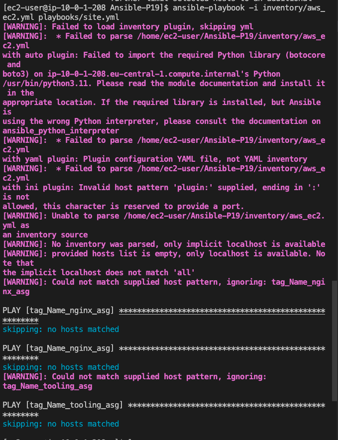

Run the below command to solve this error

```
sudo dnf update
sudo dnf install python3-devel
curl https://bootstrap.pypa.io/get-pip.py -o get-pip.py
sudo python3.11 get-pip.py
pip3.11 --version
pip install boto3 botocore
```

Another step we need to take on our bastion server before we run our ansible playbook command is to configure AWS CLI.

- The `aws configure` command allows you to provide your AWS access key and secret access key as usual, which are used to authenticate your Ansible playbook with AWS services. This is crucial because AWS resources, such as EC2 instances, S3 buckets, and RDS databases, require proper authentication to interact with them. And since we are making use of AWS dynamic inventory plugin in Ansible configaration, it relies on the AWS CLI configuration to discover and list AWS resources. By configuring the AWS CLI on the bastion host, we ensure that the dynamic inventory plugin can authenticate with AWS and query AWS resources correctly.

We can go ahead to run our ansible playbook command now

`cd Ansible-P19/`

`ansible -i inventory/aws_ec2.yml playbooks/site.yml`

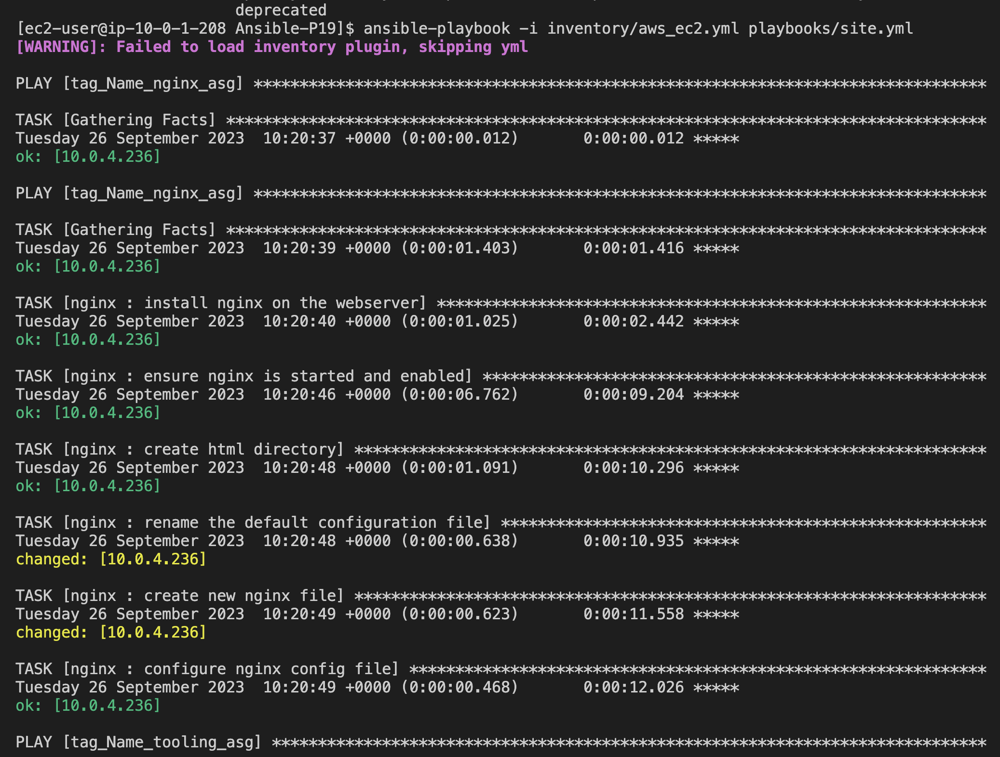

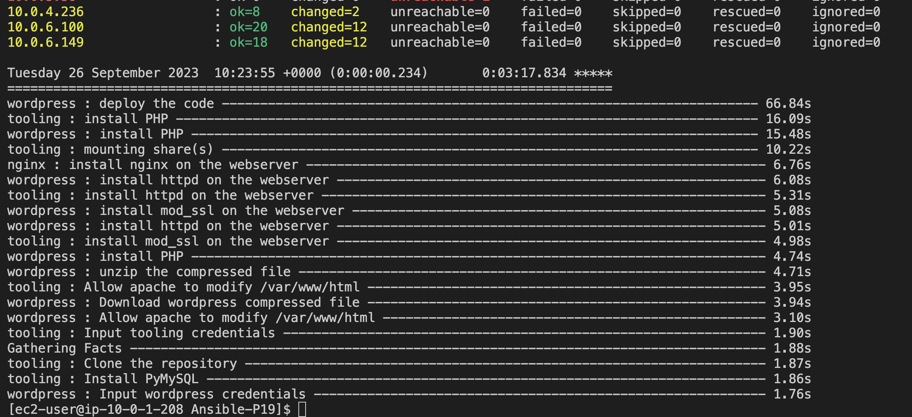

### Webservers Configuration

We need to ssh into the webservers to for proper configuration, that is the purpose of the bastion server

`ssh proxy`

Check the nginx status

Run `systemctl status nginx`

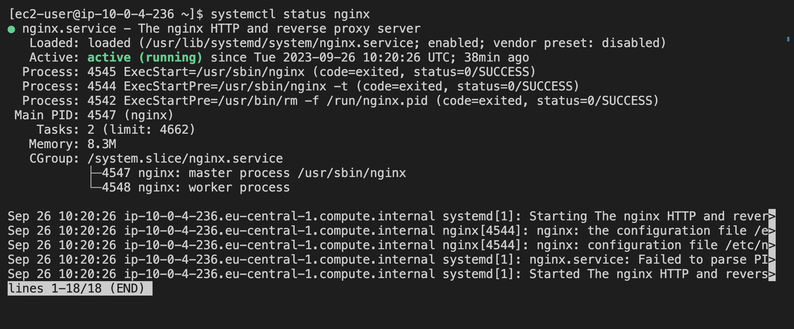

`ssh tooling`

`curl localhost`

[tooling stat](./Images/localhost-tooling.png)

Our tooling config appears to be intact

Let's check the wordpress server

`ssh wordpress`

`curl localhost`

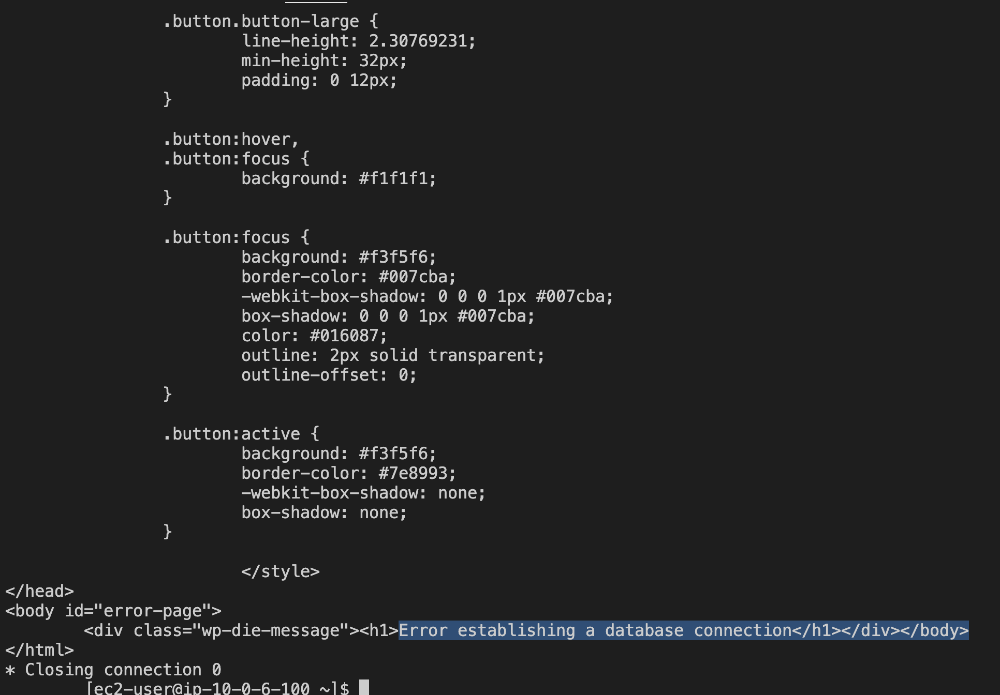

There is an error with the database connection. To fix this we need to open the wordpress config file and edit the databased details accordingly.

`sudo vi /var/www/html/wp-config.php`


Save and exit


Now, we are sure our proxy server will be able to successfully route traffic to the wordpress and tooling servers, since we can confirm that they are healthy.

Next step is to go back to the terraform infrastructure and uncomment the listeners and attachment group we commented out, then push the code back to github, so our terraform-cloud can run `plan` and `apply`.


Head to your AWS account, let's have a look at the resources created.


It has been confirmed that all of our target group instances are healthy, and ready to receive traffic.

Let's access our `applications` from the browser through the domain name.


Automate-Infrastructure-With-IaC-using-Terraform-Part4–Terraform_Cloud

Automate-Infrastructure-with-IaC-using-Terraform-Part4-Terraform_Cloud
